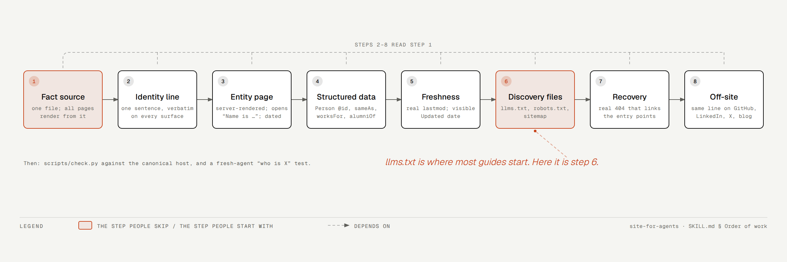
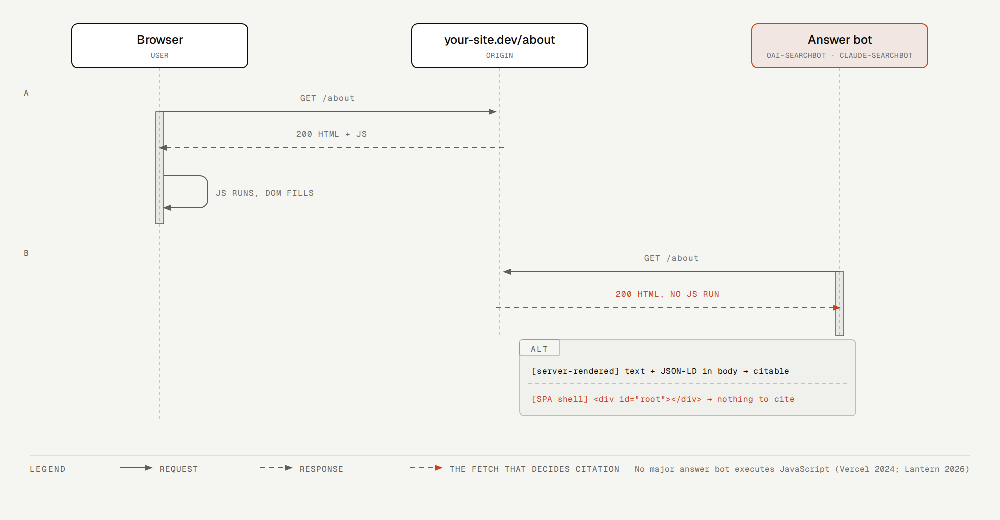
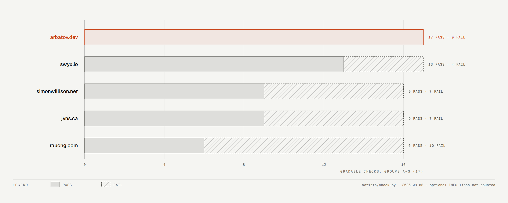

# site-for-agents

An agent skill that makes a personal website **findable, readable, and quotable
by AI agents and answer engines** (ChatGPT search, Claude, Perplexity, Google AI
Mode, coding agents).

Most advice sold as "GEO" does not move citation rate, but what actually does, per the
2026 log studies and papers collected in
[references/levers.md](skills/site-for-agents/references/levers.md):
an entity page with a definitional first sentence and dated facts, one
identity line repeated on every profile, server-rendered content, allowed
answer bots, and honest freshness. `llms.txt` is just a starting point.

The skill gives an agent the order of work, the JSON-LD shape that passes
the schema validator, the traps that cost real time (root `index.md`
hijacking `/`, 404 shells that flash the homepage, testing the alias host
instead of the canonical one), and a stdlib-only checker.



The engines that cite you never run your JavaScript. Only coding agents send
`Accept: text/markdown`; answer bots fetch the HTML URL and read what is in
the body. A single-page app shell gives them nothing.



## Install

```bash
npx skills add vladzima/site-for-agents -g --all
```

## Check a site

```bash
python3 skills/site-for-agents/scripts/check.py https://example.com --name "Full Name"
```

Output is a scorecard, one line per check with the evidence:

```
  PASS A1  example.com/ serves 200 with 17,553 bytes
  PASS A3  robots.txt allows all 8 answer bots
  FAIL C1  no entity page found at /about, /about-me, /bio, /cv, /resume, /me …
  FAIL D1  identity line differs on: og:description, llms.txt blockquote; one string, everywhere
  FAIL E1  all 14 sitemap lastmod values are '2026-09-04'; a uniform build date is not a freshness signal
```

| Group | Question the agent has |
|---|---|
| A Reachable | Can I fetch it at all? Canonical host answers 200, answer bots allowed, real 404s |
| B Readable | Can I read it without a browser? Every sitemap page has an H1 and text with JS stripped |
| C Identifiable | Who is this, in one fetch? Entity page opens "Name is …"; Person JSON-LD with `@id`, `sameAs`, `worksFor`, `knowsAbout` |
| D Consistent | Do the facts agree? One identity line on meta, OG, JSON-LD, llms.txt; dated roles |
| E Fresh | Is this current? Distinct `lastmod` values; an Updated date on the entity page |
| F Discoverable | Where do I start? `llms.txt` shape and links; sitemap covers what llms.txt links |
| G Recoverable | What if I hit a dead link? 404 body links entry points; 404 HTML is not the homepage |
| H Off-site | Does the web agree? Manual: bios on GitHub, LinkedIn, X, blog; backlinks; author names on works |

Exit code is 1 when any check fails, so it can gate a deploy.



Five personal sites, same 17 gradable checks, 2026-09-05. The four that
fail are well-built sites by well-known engineers; what they lack is an
entity page, Person JSON-LD, and an honest `lastmod`.

## Scope

A person. A company site needs `Organization`, products, and support pages
instead of a career timeline. The bot list in `check.py` is data; crawler
names change every few months.

## License

MIT
